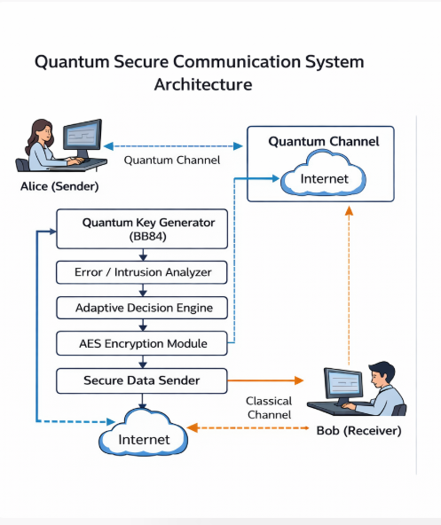
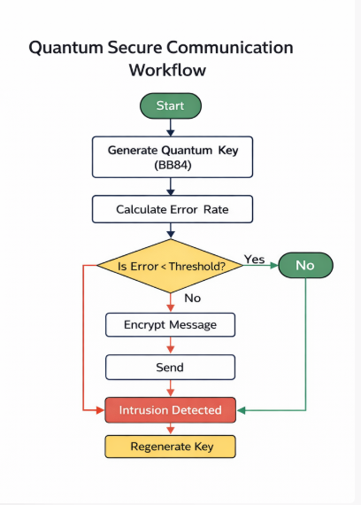

# Quantum-Resilient Secure Communication

A working demonstration of **Quantum Key Distribution (BB84)** combined with **AES encryption**, where the key that comes out of the quantum exchange is the key that actually protects the message — not a separate, unrelated one.

It simulates Alice and Bob exchanging qubits over a quantum channel, detects whether an eavesdropper tampered with that exchange, and only encrypts the message if the channel checks out clean.                                       


## Table of contents
- [Why this exists](#why-this-exists)
- [How it works](#how-it-works)
- [Quick start](#quick-start)
- [CLI options](#cli-options)
- [Example output](#example-output)
- [Project structure](#project-structure)
- [Running the tests](#running-the-tests)
- [Notebooks](#notebooks)
- [Limitations](#limitations)
- [Use cases](#use-cases)

## Why this exists


Classical key exchange (RSA, Diffie-Hellman) relies on math problems that a sufficiently large quantum computer could eventually break. QKD takes a different approach: the security comes from physics, not computational hardness. Measuring a qubit disturbs it, so any eavesdropper intercepting the key exchange leaves a detectable trace — an elevated error rate between what Alice sent and what Bob received.

This project demonstrates that detection mechanism end to end, and — unlike a lot of toy BB84 demos — actually uses the resulting key to encrypt something, rather than discarding it after the error-rate check.

## How it works

<p align="center">
  
</p>

1. **Quantum key exchange (BB84).** Alice encodes random bits in random bases and sends them as qubits. Bob measures each one in a randomly chosen basis of his own. Wherever their bases happen to match, the bit is kept — this sifted set is the raw key.
2. **Eavesdropper check.** Alice and Bob compare a sample of their sifted key. If an eavesdropper (Eve) intercepted and resent qubits along the way, her measurements unavoidably disturb some of them, raising the error rate between Alice's and Bob's bits — the Quantum Bit Error Rate (QBER).
3. **Intrusion decision.** If the QBER stays under a threshold (11% by default — the standard bound against intercept-resend attacks), the key is accepted. Otherwise it's rejected and no message is sent.
4. **Key derivation.** An accepted key is run through HKDF-SHA256 to produce a uniform 32-byte key, formatted for use with Fernet (AES-128 + HMAC). This is the step that was missing from earlier prototypes — the quantum key now actually generates the encryption key, instead of an unrelated one being generated separately.
5. **Encryption.** The message is encrypted and decrypted with that derived key.

<p align="center">
  
</p>

## Quick start

```bash
git clone <your-repo-url>
cd Quantum-Resilient-Secure-Communication
python -m venv .venv && source .venv/bin/activate   # optional but recommended
pip install -r requirements.txt

cd src
python main.py
```

This runs two scenarios — a clean channel and one with an eavesdropper — and writes the logs plus a comparison chart to `results/`.

## CLI options

```bash
python main.py --message "Custom message" --key-length 512 --threshold 0.11 --seed 42  
```

| Flag | Default | Description |
|---|---|---|
| `--message` | demo message | Message to encrypt and send |
| `--key-length` | `256` | Number of raw qubits Alice sends |
| `--threshold` | `0.11` | QBER above which intrusion is flagged |
| `--seed` | none | Seed for fully reproducible runs |
| `--output-dir` | `../results` | Where to write logs and the chart |

## Example output

```
===== CASE 1: NORMAL COMMUNICATION =====
Raw qubits sent     : 256
Sifted key length   : 121
Error Rate (QBER)   : 0.00
Secure Channel Established
Decrypted Message   : Hello Bob, this is a quantum-resilient secure message

===== CASE 2: ATTACK SCENARIO =====
Raw qubits sent     : 256
Sifted key length   : 121
Error Rate (QBER)   : 0.30
Intrusion Detected!
Quantum Key Rejected. A new key exchange would be required.
```

The ~0.25–0.30 QBER under attack matches the textbook value for an intercept-resend attack against BB84 — well clear of the 0.11 detection threshold.

## Project structure

```
src/
  quantum_key_generator.py   BB84 simulation (Qiskit), with a real intercept-resend Eve
  key_derivation.py          HKDF-SHA256: turns the sifted key into an AES key
  intrusion_detection.py     QBER-threshold accept/reject decision
  encryption_module.py       AES (Fernet) encrypt/decrypt
  secure_communication.py    Ties the above together
  visualization.py           Saves the error-rate comparison chart
  main.py                    CLI entry point
tests/                       22 pytest tests
notebooks/
  bb84_simulation.ipynb      Step-by-step walkthrough of the protocol
  results_analysis.ipynb     Reads results/ and re-plots the comparison
diagrams/                    Architecture and workflow diagrams
results/                     Logs and chart, regenerated on every run
```

## Running the tests

```bash
pytest tests/ -v
```

22 tests cover key generation (including that an eavesdropper-free run has zero error and an intercepted one doesn't), intrusion detection thresholds, key derivation, encryption round-trips and failure modes, and a full end-to-end integration test.

## Notebooks

- `bb84_simulation.ipynb` walks through a single qubit's journey through BB84 step by step.
- `results_analysis.ipynb` reads the log files in `results/` and reproduces the comparison chart — run `main.py` at least once first so there's something to read.

## Limitations

This is a learning/demo project, not a production cryptographic system:

- **Privacy amplification is simplified.** HKDF compresses the sifted key into a uniform one, but a rigorous implementation would size that compression based on an estimate of how much information Eve actually gained from the measured QBER. This project doesn't do that calculation.
- **No classical-channel authentication.** Basis reconciliation between Alice and Bob is assumed to happen over an authenticated channel. This project doesn't implement that authentication, so it defends against eavesdropping on the *quantum* channel, not a man-in-the-middle on the classical one.
- **Simulated, not physical.** The "quantum channel" is a Qiskit simulator. Real QKD systems contend with hardware noise, photon loss, and detector imperfections that this project doesn't model.

## Use cases

Illustrative scenarios this kind of architecture is relevant to: financial transactions, quantum-safe messaging, IoT device security, healthcare data transmission, and government/defense communications.


---

**Author**  
Anwita Padhi 
